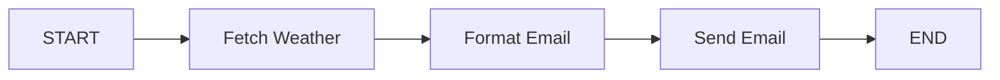

# 🌤️ Weather Agent using LangChain.js & LangGraph.js

An intelligent weather notification system built with **LangChain.js** and **LangGraph.js** that automatically fetches weather data and sends beautifully formatted email updates. This project demonstrates AI agent orchestration using state graphs and tool-based workflows.

## ✨ Features

- 🤖 **AI Agent Workflow**: Built using LangGraph's state graph for orchestrating complex workflows
- 🌍 **Real-time Weather Data**: Fetches current weather information from OpenWeatherMap API
- 📧 **Automated Email Notifications**: Sends formatted weather updates via Gmail
- 🔧 **Tool-based Architecture**: Modular design with dedicated tools for each operation
- 🎯 **Type-safe Implementation**: Written in TypeScript with Zod validation
- 🚀 **RESTful API**: Express.js backend with clean MVC architecture

## 🏗️ Project Structure

```
weather-agent-using-langchainjs-langgraphjs/
└── backend/
    ├── src/
    │   ├── agents/
    │   │   ├── tools/
    │   │   │   ├── fetchWeather.tool.ts      # Fetches weather from OpenWeatherMap
    │   │   │   ├── formatWeatherEmail.tool.ts # Formats weather into email body
    │   │   │   └── sendEmail.tool.ts          # Sends email via Nodemailer
    │   │   └── weatherEmail.agent.ts          # LangGraph workflow orchestration
    │   ├── controllers/
    │   │   └── weatherEmail.controller.ts     # Request handlers
    │   ├── routes/
    │   │   └── weatherEmail.route.ts          # API routes
    │   ├── models/
    │   │   └── weatherEmail.model.ts          # Mongoose schema (for future use)
    │   ├── validations/
    │   │   └── weatherEmail.validation.ts     # Zod validation schemas
    │   └── index.ts                           # Express app entry point
    ├── .env                                   # Environment variables
    ├── package.json                           # Dependencies
    └── tsconfig.json                          # TypeScript configuration
```

## 🔧 Technology Stack

- **Runtime**: Node.js with TypeScript
- **Framework**: Express.js
- **AI/ML**:
  - [@langchain/core](https://www.npmjs.com/package/@langchain/core) - Core LangChain functionality
  - [@langchain/langgraph](https://www.npmjs.com/package/@langchain/langgraph) - State graph orchestration
- **APIs**:
  - OpenWeatherMap API - Weather data
  - Gmail SMTP - Email delivery
- **Validation**: Zod
- **Database**: Mongoose (for future persistence)
- **Package Manager**: pnpm

## 📋 Prerequisites

Before you begin, ensure you have the following:

- **Node.js** (v18 or higher)
- **pnpm** package manager
- **OpenWeatherMap API Key** - [Get it here](https://openweathermap.org/api)
- **Gmail App Password** - [Generate here](https://myaccount.google.com/apppasswords)

## 🚀 Getting Started

### 1. Clone the Repository

```bash
git clone https://github.com/yourusername/weather-agent-using-langchainjs-langgraphjs.git
cd weather-agent-using-langchainjs-langgraphjs/backend
```

### 2. Install Dependencies

```bash
pnpm install
```

### 3. Configure Environment Variables

Create a `.env` file in the `backend` directory:

```env
# OpenWeatherMap API Key
OPENWEATHER_API_KEY=your_openweather_api_key

# Gmail Configuration
GMAIL_USER=your-email@gmail.com
GMAIL_PASSWORD=your-gmail-app-password

# Optional: OpenRouter API Key (for future LLM integration)
OPENROUTER_API_KEY=your_openrouter_api_key

# Optional: Database Configuration
MONGODB_URI=mongodb://localhost:27017/weatheragent
REDIS_HOST=localhost
REDIS_PORT=6379
```

> **⚠️ Important**:
>
> - Use a Gmail **App Password**, not your regular password
> - Keep your `.env` file secure and never commit it to version control

### 4. Run the Application

**Development Mode** (with hot reload):

```bash
pnpm run dev
```

**Production Mode**:

```bash
pnpm start
```

The server will start on `http://localhost:5001` (or the PORT specified in your .env)

## 📡 API Endpoints

### Send Weather Email

Sends a weather update email for a specified city.

**Endpoint**: `POST /api/weatherEmail/sendWeatherEmail`

**Request Body**:

```json
{
  "city": "Mumbai",
  "recipientEmail": "recipient@example.com"
}
```

**Response** (Success - 200):

```json
{
  "success": true,
  "message": "Weather email sent successfully",
  "result": "Email sent successfully",
  "city": "Mumbai"
}
```

**Response** (Error - 500):

```json
{
  "error": "Failed to send weather email"
}
```

### Example using cURL

```bash
curl -X POST http://localhost:5001/api/weatherEmail/sendWeatherEmail \
  -H "Content-Type: application/json" \
  -d '{
    "city": "Mumbai",
    "recipientEmail": "your-email@gmail.com"
  }'
```

### Example using JavaScript/Fetch

```javascript
fetch("http://localhost:5001/api/weatherEmail/sendWeatherEmail", {
  method: "POST",
  headers: {
    "Content-Type": "application/json",
  },
  body: JSON.stringify({
    city: "Mumbai",
    recipientEmail: "your-email@gmail.com",
  }),
})
  .then((response) => response.json())
  .then((data) => console.log(data));
```

## 🤖 How It Works

The application uses **LangGraph** to create an AI agent workflow with three sequential steps:



### Workflow Steps

1. **Fetch Weather Node** (`fetchWeatherNode`)

   - Uses the `fetchWeatherTool` to get weather data from OpenWeatherMap API
   - Returns temperature, feels like, description, humidity, wind speed, and icon

2. **Format Email Node** (`formatEmailNode`)

   - Uses the `formatWeatherEmailTool` to create a beautifully formatted email body
   - Includes weather emojis and professional formatting

3. **Send Email Node** (`sendEmailNode`)
   - Uses the `sendEmailTool` to send the email via Gmail SMTP
   - Returns success/failure status

### State Management

The agent maintains state throughout the workflow:

```typescript
{
  city: string,              // City for weather lookup
  recipientEmail: string,    // Email recipient
  weatherData: object,       // Fetched weather data
  formattedEmail: string,    // Formatted email body
  result: string,            // Final result message
  error: string | null       // Error message if any
}
```

## 📧 Email Format

The generated email looks like this:

```
Dear User,

Here's your daily weather update for Mumbai:

🌡️ Temperature: 31.99°C
🤔 Feels Like: 30.09°C
☁️ Conditions: smoke
💧 Humidity: 22%
💨 Wind Speed: 3.6 m/s

Have a great day!

Best regards,
Your Weather Bot
```

## 🛠️ Development

### Project Scripts

| Script         | Description                            |
| -------------- | -------------------------------------- |
| `pnpm start`   | Run the application in production mode |
| `pnpm run dev` | Run with hot reload using nodemon      |

### Code Structure

- **Tools**: Encapsulated LangChain tools in `src/agents/tools/`
- **Agent**: State graph workflow in `src/agents/weatherEmail.agent.ts`
- **MVC Pattern**: Separation of routes, controllers, and models
- **Validation**: Zod schemas for type-safe input validation

## 🔍 Troubleshooting

### Common Issues

#### 1. "OpenWeather API key is not set"

- Ensure `OPENWEATHER_API_KEY` is correctly set in your `.env` file
- Verify the API key is valid at [OpenWeatherMap](https://openweathermap.org/)

#### 2. "Error sending email"

- Verify `GMAIL_USER` and `GMAIL_PASSWORD` are correct
- Ensure you're using a Gmail **App Password**, not your regular password
- Check if "Less secure app access" is enabled (if not using App Password)
- Verify your Gmail account allows SMTP access

#### 3. TypeScript Configuration Error

- Ensure `tsconfig.json` is in the `backend` directory (not in `backend/src`)
- The `rootDir` should be `./src` and `include` should be `["src/**/*"]`

#### 4. "Cannot find module"

- Make sure all imports use `.js` extension (required for ES modules with Node16 resolution)
- Run `pnpm install` to ensure all dependencies are installed

#### 5. Port Already in Use

- Change the `PORT` in your `.env` file
- Or kill the process using the port: `lsof -ti:5001 | xargs kill`

## 🚧 Future Enhancements

- [ ] Add MongoDB integration for storing weather preferences
- [ ] Implement scheduled emails using node-cron
- [ ] Add LLM integration for personalized weather summaries
- [ ] Create frontend UI for managing subscriptions
- [ ] Add support for multiple cities and recipients
- [ ] Implement Redis caching for weather data
- [ ] Add weather alerts and notifications
- [ ] Support for different email templates

## 📝 License

This project is licensed under the ISC License.

## 🤝 Contributing

Contributions are welcome! Feel free to:

1. Fork the repository
2. Create a feature branch (`git checkout -b feature/AmazingFeature`)
3. Commit your changes (`git commit -m 'Add some AmazingFeature'`)
4. Push to the branch (`git push origin feature/AmazingFeature`)
5. Open a Pull Request

## 📧 Contact

For questions or support, please open an issue on GitHub.

---

**Built with ❤️ using LangChain.js and LangGraph.js**
